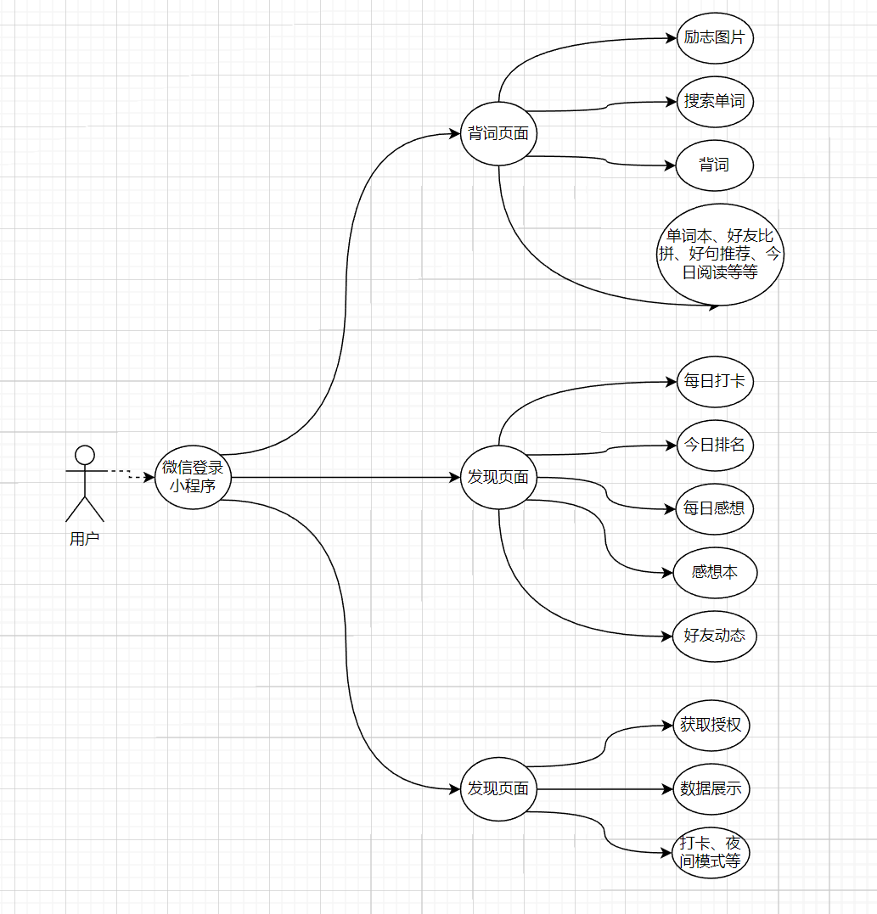
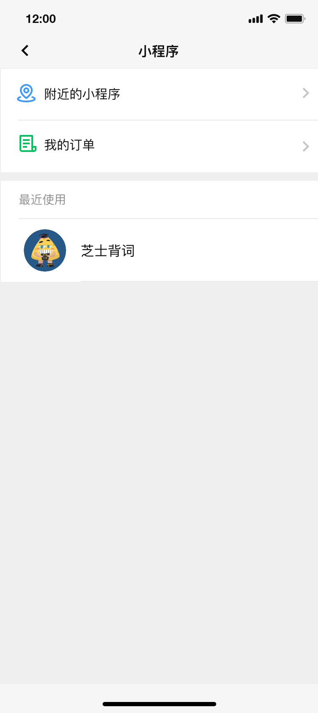
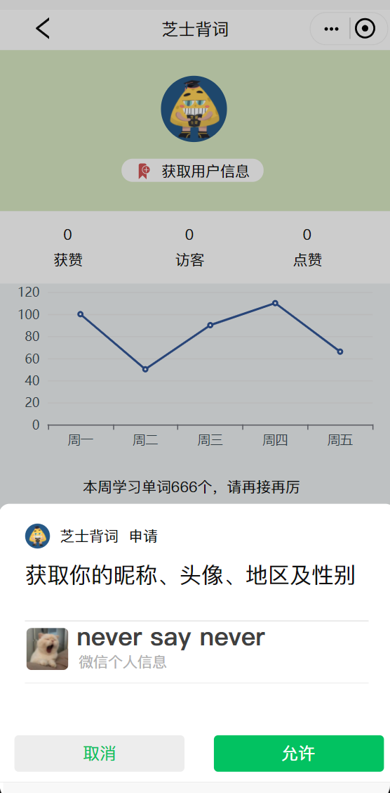
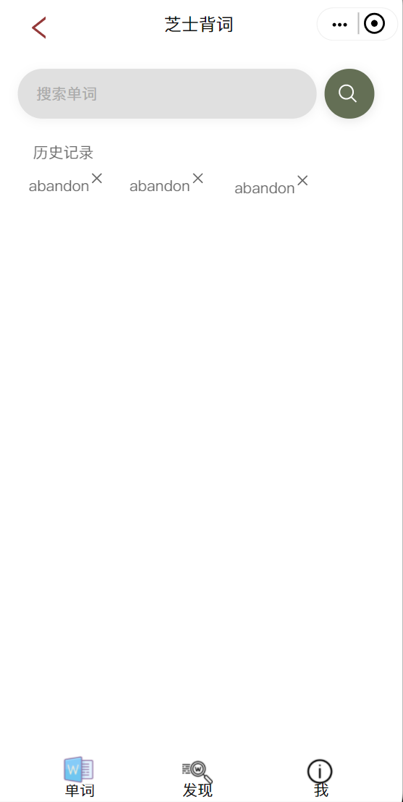
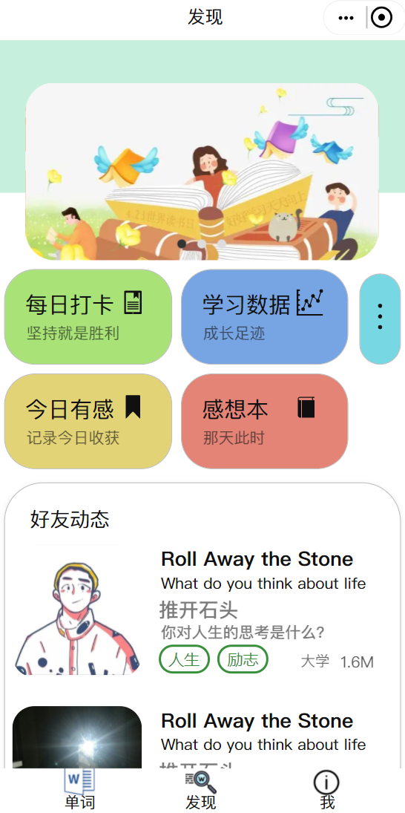
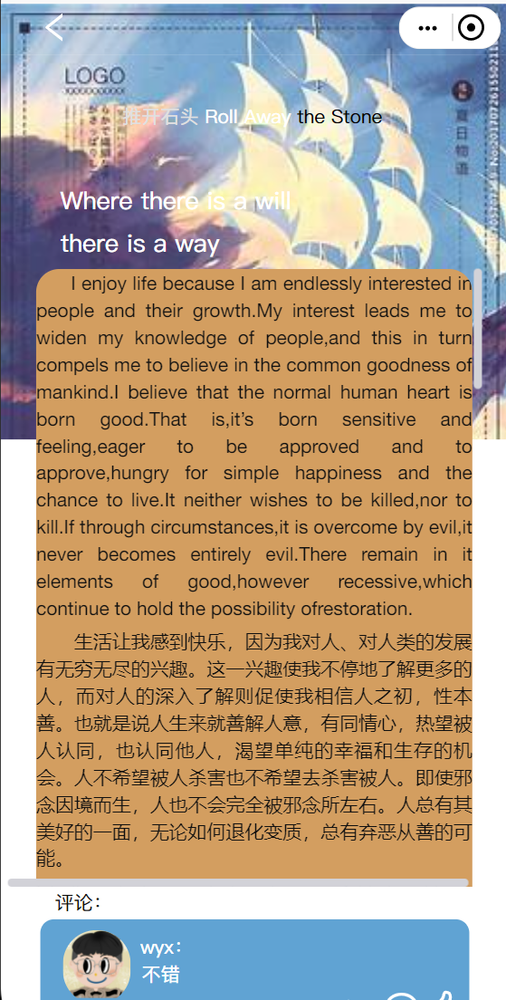
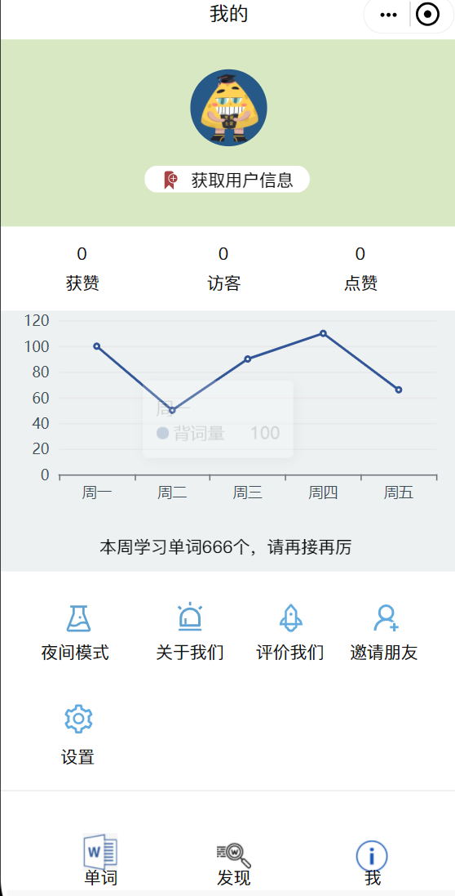

## 产品描述

本产品是一个背单词的软件，我们用微信小程序的形式实现我们的软件，在项目管理上使用Gitee平台对我们的代码和资源文件进行管理。

该软件的功能是让用户更加方便、更加科学高效地背单词，除此之外，我们还加入了一些其他的功能，从而让用户更大程度地提升自己的英语能力。

## 产品功能
我们的背单词软件主要实现了以下功能：

背词页面：背词，单词本，文章详情，更多文章推荐，励志语句详情，搜索单词

搜索单词页面：根据输入自动补充，历史记录的查看和删除

好友比拼页面：排行，点赞等

更多文章页面：不同文章分类，文章详情

文章页面：文章内容呈现，查看文章评论，发表评论，对评论点赞等

发现页面：每日打卡，学习数据，今日有感，感想本，好友动态，更多好友动态

“我的”页面：获取用户头像，学习数据呈现，夜间模式，关于我们，评价我们，邀请朋友，设置

设置界面：清除数据等

## 系统用例
系统用例图如下：

## 系统功能描述
在微信上以小程序的形式开发，用户信息以及登录功能用微信自带的一些接口，页面包括三个主页面，即背词页面，发现页面和我的页面，每个页面中都有一些列与背词有关的功能。

### 用户登入
用户的登录直接用微信的登录方式

### 背词页面
背词页面有众多功能，主要包括背词，单词本，文章详情，更多文章推荐，励志语句详情，搜索单词等，这里的功能主要与背词相关，用户根据自己的需求选择不同的功能即可进入对应的子页面，以下的图片只显示了一个单词搜索的功能，详细可以看墨刀原型展示。

### 发现页面
发现页面也有不同的功能供用户选择，主要包括每日打卡，学习数据，今日有感，感想本，好友动态，更多好友动态等，这里的功能主要是辅助英语学习相关，是背词功能的一些拓展，用户根据自己的需求选择不同的功能即可进入对应的子页面，以下的图片只显示了一个好友文章查看的功能，详细可以看墨刀原型展示。

###	‘我的’页面
在‘我的’页面，主要是一些学习数据，夜间模式，个人账户设置等功能，这部分功能属于一些辅助功能，用户根据自己的需求选择不同的功能即可进入对应的子页面，以下的图片只显示了一个查看的功能，详细可以看墨刀原型展示。

